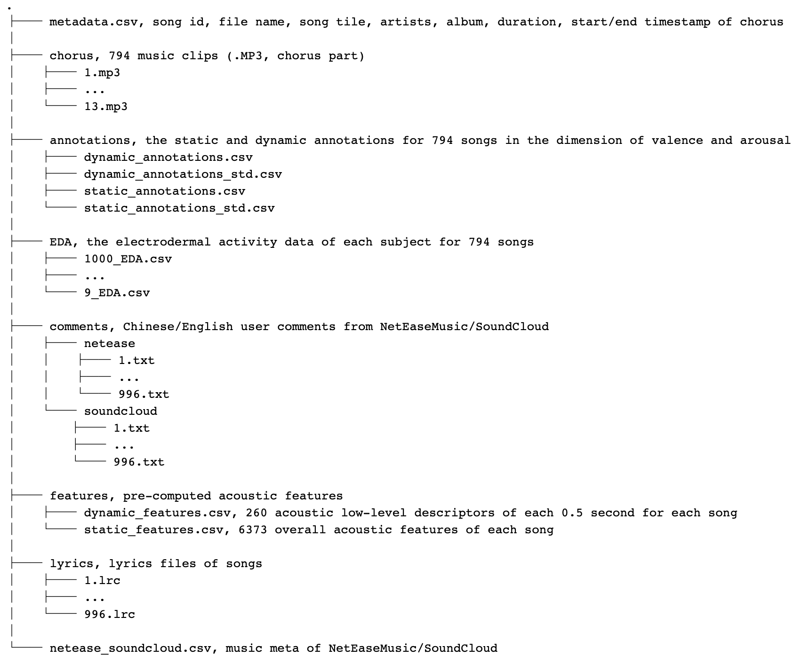

# PMEmo: A Dataset For Music Emotion Computing
PMEmo is a popular music dataset with emotional annotations: 

> Music Emotion Recognition (MER) has recently received considerable attention. To support the MER research which requires large music content libraries, we present the PMEmo dataset containing emotion annotations of 794 songs as well as the simultaneous electrodermal activity (EDA) signals. A Music Emotion Experiment was well-designed for collecting the affective-annotated music corpus of high quality, which recruited 457 subjects.  
> 
> The dataset is publically available to the research community, which is foremost intended for benchmarking in music emotion retrieval and recognition. To straightforwardly evaluate the methodologies for music affective analysis, it also involves pre-computed audio feature sets. In addition to that, manually selected chorus excerpts (compressed in MP3) of songs are provided to facilitate the development of chorus-related research.

In Our article, [The PMEmo Dataset for Music Emotion Recognition](https://dl.acm.org/citation.cfm?id=3206037), We describe in detail the resource acquisition, subject selection, experiment design and annotation collection procedures, as well as the dataset content and data reliability analysis. We also illustrate its usage in some simple music emotion recognition tasks which testified the PMEmo dataset's competence for the MER work. Compared to other homogeneous datasets, PMEmo is novel in the organization and management of the recruited annotators, and it is also characterized by its large amount of music with simultaneous physiological signals.

To briefly summarize, the PMEmo dataset provides:

* song metadata (song title, artists, beginning and ending timestamps of chorus section);
* manually selected music chorus clips (MP3);
* pre-computed audio features for use in MER tasks;
* manually annotated emotion labels: static labels for the whole clips (i.e., overall labels), and dynamic labels for each 0.5-second segment (i.e., continuous labels over time);
* Corresponding EDA physiological signals.

New contents have been added to the updated dataset:

* song lyrics (LRC),
* song comments from online music websites (Chinese and English texts).

## Data Description
The whole [PMEmo dataset](http://pmemo.hellohui.cn/) of approximately 1.3 GB can be downloaded online. Considering copyright restrictions,
full songs are not included in this dataset but the chorus
excerpts are available in PMEmo. To make the data accessible and
compatible for a wide range of platforms, the metadata of songs,
the acoustic features and the annotations are all stored in CSV files
(delimited by comma).

The updated dataset consists of:  


> The first 15-second annotations are removed from the PMEmo data. All these features are extracted using OpenSMILE toolbox (See details in our paper). 

## Code & Usage
The following notebooks and scripts, stored in this repository, have been developed for the dataset.

* [transformat](transformat.sh): To transform MP3 to WAV for adapting requirememt of OpenSIMLE.
* [features](features.py): Features extracted with OpenSMILE.
* [static\_MER](static_MER.ipynb): Baseline models for static MER.
* [dynamic\_MER](dynamic_MER.ipynb): Baseline models for dynamic MER.
* [EDA\_features\_ex](EDA_features_ex.ipynb): To extract EDA features.
* [lyric\_analysis](lyric_analysis.ipynb): To get the lyric texts in chorus parts

## License & co
Please cite our [paper](https://dl.acm.org/citation.cfm?id=3206037) if you use our code or data.

```
@inproceedings{Zhang:2018:PDM:3206025.3206037,
 author = {Zhang, Kejun and Zhang, Hui and Li, Simeng and Yang, Changyuan and Sun, Lingyun},
 title = {The PMEmo Dataset for Music Emotion Recognition},
 booktitle = {Proceedings of the 2018 ACM on International Conference on Multimedia Retrieval},
 series = {ICMR '18},
 year = {2018},
 isbn = {978-1-4503-5046-4},
 location = {Yokohama, Japan},
 pages = {135--142},
 numpages = {8},
 url = {http://doi.acm.org/10.1145/3206025.3206037},
 doi = {10.1145/3206025.3206037},
 acmid = {3206037},
 publisher = {ACM},
 address = {New York, NY, USA},
 keywords = {dataset, eda, experiment, music emotion recognition},
} 
```

